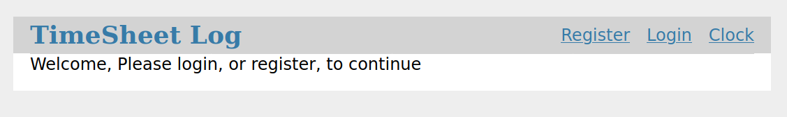

# Summary
The purpose of this api is to timestamp work hours per shift.  The user will have to sign-in for clocking in and out.  The api will utilize:
1. MySQL(MariaDB)
2. FLask and the respective extensions
3. JWT Authentication
4. SQLAlchemy

The code is structured using RESTful resource, where the codes are mainly categorized in the following directories:

  * API (RESTful methods such as get and post)
  * models (for MySql tables)
  * resources 
  * templates (HTML codes)
  
 __________________________________________________________________________________________
  
 
 # Features
  * Encrypted User Authentication
  * Database Utilization
  * New User Signup
  * User Login/Logout
  * Flask Framework
  * Hours Worked Log (WIP)
 __________________________________________________________________________________________
  
 
 # Setup
 
 The following ports must be free in order for the app and db to work.
 
   1) 5000
   2) 3306

    $ docker-compose up --build
    
Open up your browser and enter "127.0.0.1:5000" as the ip address.
